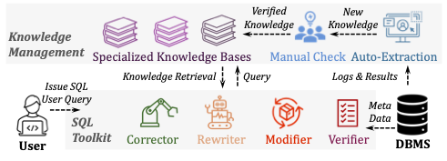

# SQLGovernor: A Hybrid Self-Learning Multi-Agent Framework for End-to-End SQL Governance
[](https://opensource.org/licenses/Apache-2.0)
<!--
[](https://arxiv.org/abs/<PaperID>)
[](https://github.com/<YourRepo>/releases/download/v1.0/payment-sql.zip)
-->

**Open-Source Components**:

- 🗃️ ​**Payment-SQL Dataset**: A mini dataset of SQL optimization tasks built based on fully industrial-scale SQL.
- 🤖 ​**Core Framework Code**: The code will be open source soon.
  - 🛠️ ​**Toolkit**: SQL Optimization, SQL Error Correction, SQL Quality Evaluation, SQL Consistency Veirification.
  - 📖 **Knowledge Base**: Task-specific knowledge bases.


  

## 📖 Overview
This repository accompanies the paper **SQLGovernor: A Hybrid Self-Learning Multi-Agent Framework for End-to-End SQL Governance** and provides:
###  **Payment-SQL Dataset**:


Table 1: Detailed Statistics on Payment-SQL
| Data Statistics           | Value |
|---------------------------|-------|
| # SQL Queries             | 50    |
| # Average Tables          | 2     |
| # Average Columns         | 11    |
| Average Token Length      | 421   |
| Max Token Length          | 1169  |
| Min Token Length          | 163   |


#### Key Observations :
Industrial-Scale Complexity:
- Average token length (421) far exceeds academic benchmarks (e.g., BIRD's 107 tokens)
- Longest query spans 1,169 tokens, reflecting real-world nested operations

Realistic Schema Interactions:
- Queries involve 2 tables and 11 columns on average, mirroring production-grade JOIN patterns

Rigorous Evaluation Baseline:
- Minimum token length (163) still surpasses Spider 2.0’s "difficulty threshold" (160 tokens)
- For research use, this dataset benchmarks SQL optimization tools under industrial-grade complexity


<!-- 
## 🚀 Quick Start
### Step 1: Install Dependencies
```bash
pip install -r requirements.txt
-->
